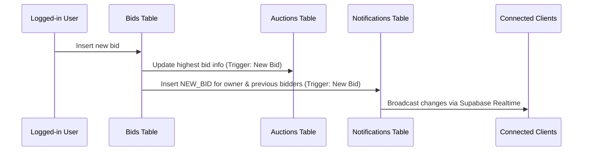
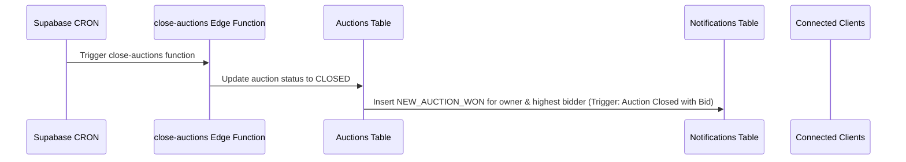
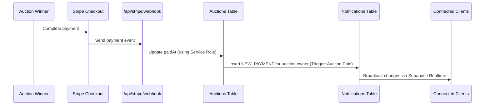

# GavL - Next Auctions – Real-Time Full-Stack Auction Platform

A real-time auction platform built with Next.js, React, TypeScript, Supabase, and Stripe. Features live bidding, payments, notifications, and responsive design for mobile and desktop.

## 🎥 Demo / Video Walkthrough

Walkthrough playlist: [YouTube Playlist](https://www.youtube.com/watch?v=hLpAKQV34Ok&list=PLrUSgs1cNYobkqnvP3VKCgiZ8tjg8Zhbj&index=3)

Videos cover:

- Real-time bidding with multiple users and notifications  
- Auction end workflow with Stripe Checkout payment  
- Responsiveness: mobile and desktop views  

## 🧱 Tech Stack

- **Frontend:** React, Next.js, TypeScript  
- **Backend & Database:** Supabase (Realtime, Edge Functions, CRON)  
- **Payments:** Stripe (Checkout & Webhooks)  
- **UI & Validation:** Shadcn/UI, React-Hook-Form, Zod  
- **Data Display:** TanStack Table
- **Nuqs:** server-side filters / sorting / pagination
- **File Uploads:** Uppy  
- **Testing:** Jest  
- **UX Enhancements:** React Suspense & skeleton loaders for smooth transitions  

## ⚙️ Architecture Overview

GavL – Next Auctions follows a lightweight domain-driven design structure for clarity and maintainability.

- **Domains:** Core types and Zod schemas for all entities (Auction, Bid, Notification, Payment, User)  
- **Ports:** Repository interfaces defining all data access methods  
- **Services:** Business logic and workflows  
- **Instances:** Service instances wired with Supabase repository implementations  
- **Infra (Supabase):** Implements data repositories that map DB rows to domain models and safely handle RLS-protected operations  
- **Supabase Realtime:** Broadcasts live notifications for `NEW_BID`, `NEW_AUCTION_WON`, and `NEW_PAYMENT` events.  
- **Supabase CRON + Edge Function:** Closes auctions automatically when `endAt` is reached  
- **Stripe Webhook:** Updates auctions’ `paidAt` via Service Role to safely bypass RLS

## 🧩 Key Features

- Real-time bidding for multiple users  
- Live notifications (bids, auction wins, payments)  
- Stripe Checkout integration for secure payments  
- Auction creation, editing, and opening workflows  
- Dashboard with charts and totals for payments  
- Responsive mobile & desktop UI  
- Multilingual support (i18n, in progress)  
- Smooth loading states with React Suspense and skeleton placeholders  

## 🔁 Key Workflows

This project covers full auction lifecycles, multi-user interactions, real-time notifications, payments, and responsive UI across multiple devices.

### 1. Authentication

Supabase email/password sign-up and login (no email confirmation for simplicity).

### 2. Server-side Filter / Sort / Pagination on Auctions Tables

Filters, sorting, and pagination are URL-driven via **nuqs**.  
The server reads `searchParams` and performs filtering, ordering, and pagination via the `auctions().listing` service, which delegates to the `SupabaseAuctionRepository`.
This approach allows users to share URLs and ensures consistent results between client and server.

### 3. Auction Creation & Management

Authenticated users can create draft auctions, add images, edit auctions, and open them for bidding.  
Owners cannot edit auctions that already have bids or are closed.

### 4. Real-time Bidding

Multiple users can place bids simultaneously.
When a new bid is submitted, the auction’s highest bid and highest bidder are updated, and relevant users (owner and previous bidders) are notified (`NEW_BID` notification) in real time via **Supabase Realtime**.



### 5. Auction End (CRON + Edge Function)

Auctions close automatically at their scheduled end time via a Supabase CRON job that periodically triggers the `close-auctions` Edge Function.
If the auction had any bids, both the auction owner and the winner are notified (`NEW_AUCTION_WON`) in real time.



### 6. Stripe Checkout & Webhook

Winning bidders complete payment via Stripe Checkout.
Once a payment succeeds, the `/api/stripe/webhook` updates the auction’s `paidAt` field (via a Service Role Supabase client to bypass RLS), and sends a `NEW_PAYMENT` notification to the auction owner in real time.



### 7. Stats & Charts

Dashboards display user-specific and global statistics, totals, and charts for payments received or made.  
All data is fetched through the same domain-driven service/repository layer to ensure consistency.
UI transitions leverage `React Suspense` and `skeleton loaders` for smooth UX during data fetching.

## 🚀 How to Run Locally

### 1. Clone the repository

```bash
git clone https://github.com/SiegfriedBz/next_auctions.git
cd next_auctions
```

### 2. Install dependencies

```bash
pnpm install
```

### 3. Set up environment variables

Create a `.env.local` file and set the following variables (based on .env.example):

```bash
# Application
NEXT_PUBLIC_APP_URL= # Base URL of your app (e.g., http://localhost:3000)

# Supabase
DATABASE_URL= # Full database connection URL (used by Supabase CLI / server)
NEXT_PUBLIC_SUPABASE_URL= # Supabase project URL for client-side access
NEXT_PUBLIC_SUPABASE_PUBLISHABLE_KEY= # Public anon key for client-side API calls
SUPABASE_SERVICE_ROLE_KEY= # Secret service role key for server-side actions (keep private!)

# Stripe
NEXT_PUBLIC_STRIPE_PUBLISHABLE_KEY= # Public key for Stripe JS (client-side)
STRIPE_SECRET_KEY= # Secret key for server-side Stripe actions (keep private!)
STRIPE_WEBHOOK_SECRET= # Secret used to verify Stripe webhooks (keep private!)
```

### 4.Push Supabase database migrations & deploy Supabase Edge Function

```bash
supabase db push
supabase functions deploy close-auctions
```

### 5.Set up **CRON**

Schedule the close-auctions **Supabase Edge Function** to run periodically to automatically close auctions at their endAt time.

### 6.Realtime Notifications (**Supabase Realtime**)

Live notifications are sent for the following events:

- New bid on an auction → auction owner & all previous bidders (`NEW_BID` notification)
- Auction closed with bids → auction owner & auction winner (`NEW_AUCTION_WON` notification)
- Auction winner has paid → auction owner (`NEW_PAYMENT` notification)

**Tip**: Use Stripe test mode with test card numbers (4242...) for local testing.

### 7.Start the development server

```bash
pnpm dev
```

GavL – Next Auctions was designed as a portfolio project to explore scalable, real-time web app patterns with Supabase, Stripe, and Next.js.

Developed with ❤️ by Siegfried Bozza — MIT License
